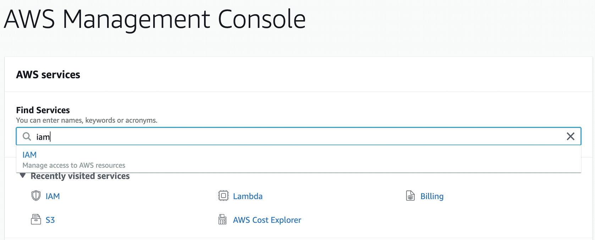
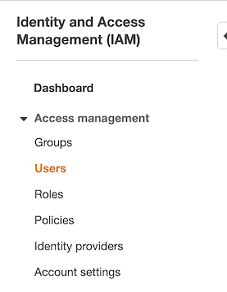
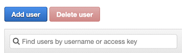
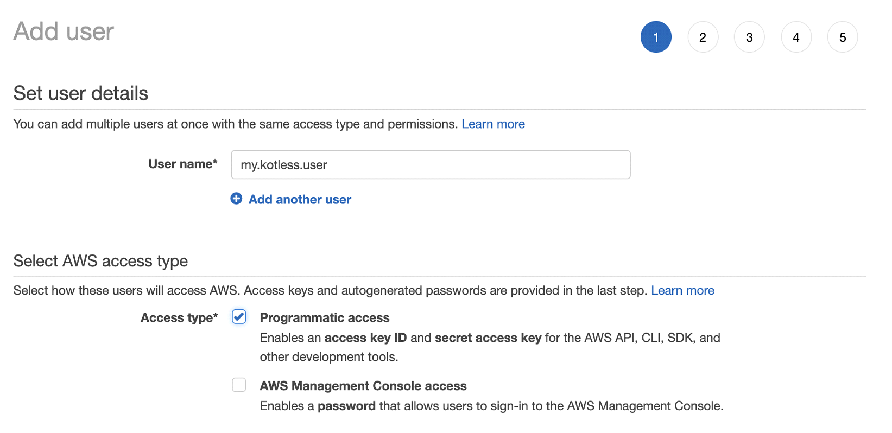
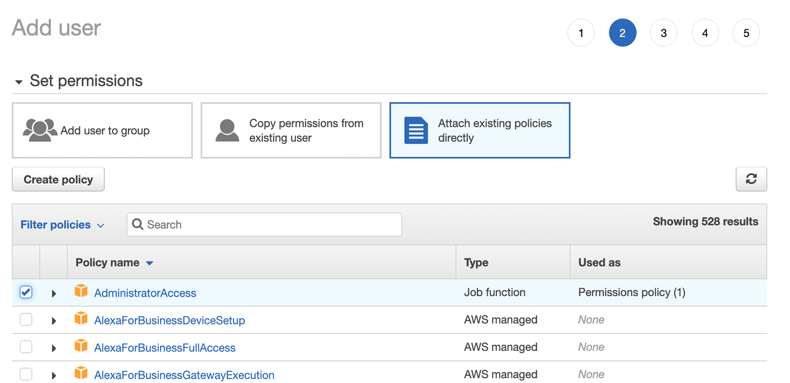
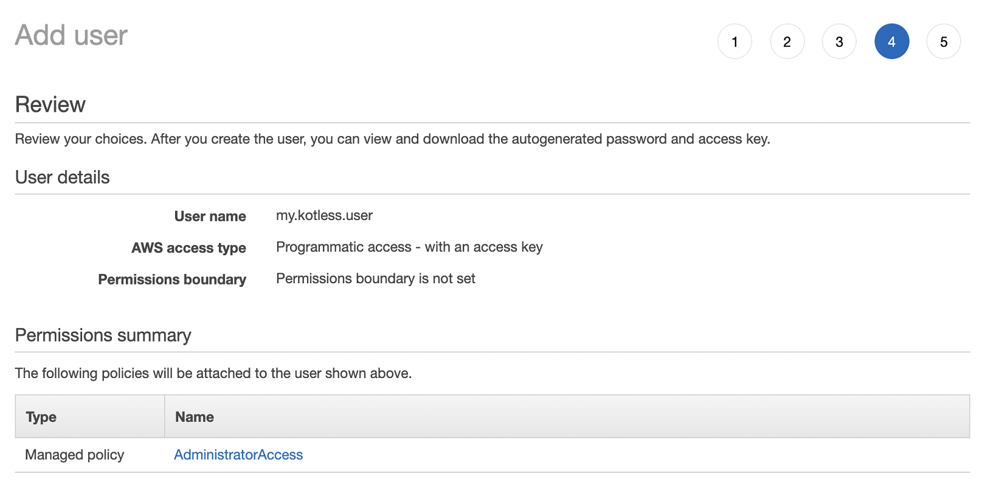
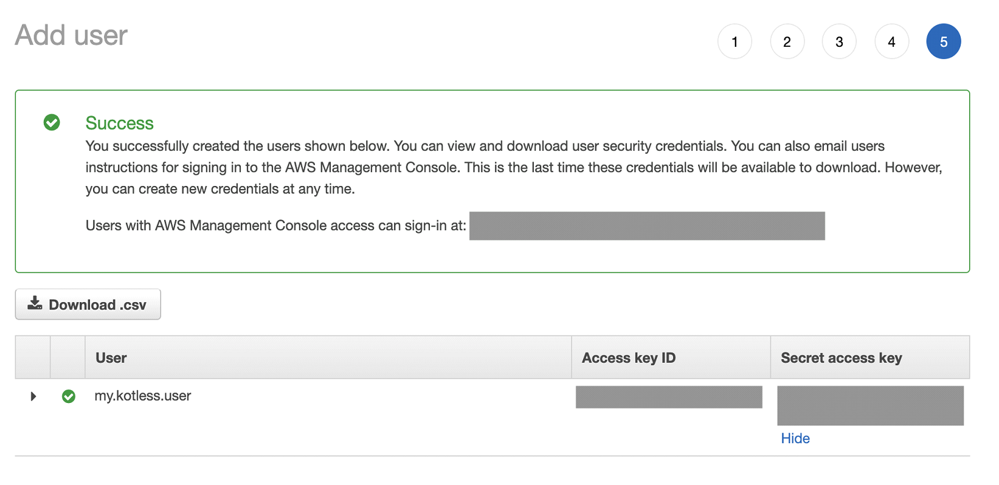
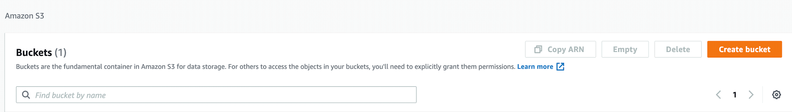
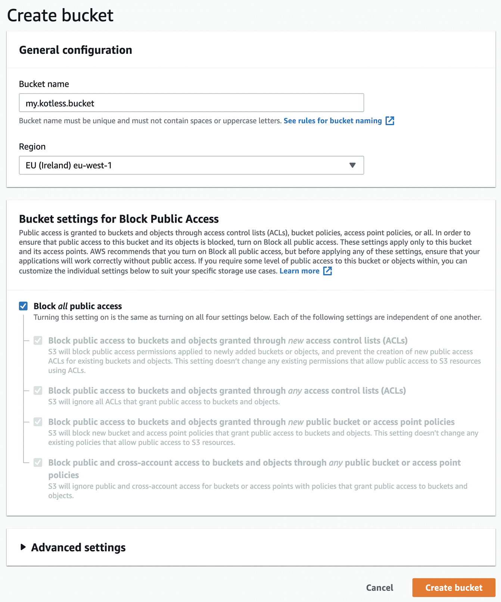

# Setting up AWS
If you’re already an expert in AWS, what you’ll need is
* IAM credentials (and stored locally too)
* A bucket (and region)

and you can skip the rest of this section and go directly to Writing our function.

If like me however, you’re mostly new to managing AWS, not only can it be extremely overwhelming, but the help is also overwhelming too. In this section I’ll briefly walk you through what you need to get the above set up.

## Step 1 - Create an AWS account
You need to provide credit card details, but stick to the free tier and you should be fine. In addition, make sure you set up some alerts in case you suddenly go beyond what free provides. For these demos though you most certainly won’t hit anything beyond free!

While you may want to download [AWS CLI](https://aws.amazon.com/cli/) for certain management aspects, note that Kotless doesn’t need it.

## Step 2 - Create IAM credentials
This is required by Kotless (Terraform actually) to deploy your functions. To do this, go to the AWS Management Console (make sure you’re logged in) and search for IAM



Once in the IAM section, proceed to create a new user account by clicking on Users



and then the Add User button



This takes you through a series of steps to provide information for the new user. This user will be defined on our local machine for Kotless to use. For this example, I’ve named it my.kotless.user.



Make sure Programmatic access is ticked.

In the next step we’re going to define permissions. Obviously this needs to be fine-tuned based on what’s needed. For now we’re going to give full Admin



The next step we’ll skip (as it’s to define tags), leading us to the final step which is to review and create the user.



Once done, you’ll be prompted with the user along with two values: Access key ID and Secret Access key.



Kotless is going to need access to the credentials created, and we need to somehow provide these. These are stored in the user directory (on macOS/Linux this would be ~/.aws and on Windows in the home directory).
Create a file name ~/.aws/credentials and type in the following contents
```
[default]
aws_access_key_id={the_access_key_id}
aws_secret_access_key={the_secret_access_key}
```

Create a file name ~/.aws/config and type in the following contents
```
[default]
region={the_region_you_work_on}
```

And that’s it. We’re now ready to write our function and deploy with Kotless.
Important - When you set up your AWS account, the system itself asks you to follow a series of good practices, such as removing root access, setting up MFA, defining groups with restricted permissions, etc. It’s important to go back and do this at some point. I’m avoiding it in here cause I know HOW EXCITED YOU ARE TO SEE THIS WORK! So let’s move on.

## Step 3 - Create an S3 bucket
Go back to the AWS Management Console and search for S3.



Click on Create bucket providing a name and region. Again, keep track of these two values as we’ll use them later.

Note: in the blow example we used "my.kotless.bucket" as the bucket name, this bucket name will be used on your project under "kotless.config.aws.storage.bucket"



Leave all other options as default.
